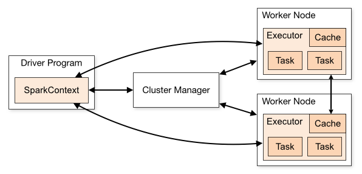

# Apache Spark

Apache Spark es un motor de procesamiento de datos en memoria de código abierto que se utiliza principalmente para realizar análisis de datos a gran escala y procesamiento de datos en tiempo real. Fue desarrollado en la Universidad de California, Berkeley, y posteriormente se convirtió en un proyecto de Apache Software Foundation en 2013.

Las características principales de Apache Spark incluyen:

Procesamiento en memoria: Spark realiza el procesamiento de datos en memoria en lugar de hacerlo en disco, lo que lo hace significativamente más rápido que otras soluciones como MapReduce en Hadoop.

Soporte para múltiples fuentes de datos: Puede trabajar con diversos tipos de datos, incluyendo datos estructurados (como tablas en bases de datos), datos semi-estructurados (como JSON y XML) y datos no estructurados (como texto).

APIs en varios lenguajes: Spark ofrece APIs en varios lenguajes de programación, incluyendo Scala, Java, Python y R, lo que facilita su integración con diferentes sistemas y aplicaciones.

Soporte para múltiples tipos de procesamiento: Además del procesamiento por lotes (batch processing), Spark también ofrece capacidades de procesamiento en tiempo real (stream processing) y procesamiento de datos iterativo (iterative processing), lo que lo hace versátil para una amplia gama de aplicaciones.

Ecosistema ampliado: Spark cuenta con un ecosistema de bibliotecas y herramientas que extienden su funcionalidad, incluyendo Spark SQL para consultas SQL, Spark Streaming para procesamiento de datos en tiempo real, MLlib para aprendizaje automático, GraphX para procesamiento de gráficos y SparkR para análisis de datos en R.

En resumen, Apache Spark es una poderosa plataforma de procesamiento de datos en memoria que ofrece velocidad, flexibilidad y capacidad de procesamiento avanzada para una variedad de aplicaciones de análisis de datos y procesamiento en tiempo real. Su arquitectura distribuida y su rico conjunto de características lo hacen popular en entornos de big data y análisis de datos a gran escala.

## Arquitectura de Apache Spark

